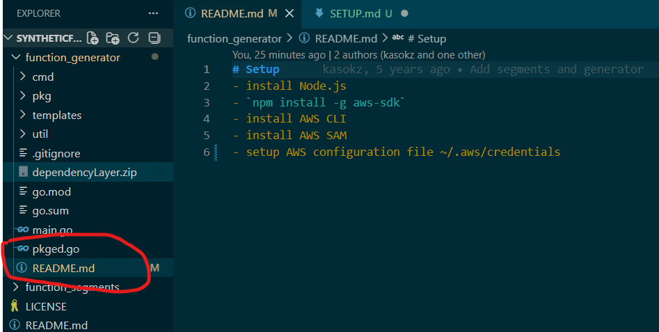

## How to Setup Amazon AWS To your computer

## Step 1:
### Download required files

The forked repo contains 2 ReadMes, one in the `function generator` folder and one outside of the folders, follow the steps within the `function generator` folder.

- Installing Node should be simple enough.

 - ### Step 1.1: Installing AWS Cli and AWS SAM:

    - install the AWS CLI by following these [instructions](https://docs.aws.amazon.com/cli/latest/userguide/getting-started-install.html):
        - just use default settings

    - install AWS SAM by following these [instructions](https://docs.aws.amazon.com/serverless-application-model/latest/developerguide/install-sam-cli.html#install-sam-cli-instructions)
        - again, default settings is fine here

    - open a new terminal and verify that they have been successfully completed:

    

 - ### Step 1.2: setting up the AWS Configuration:

    - now that everytihng has been downloaded, it is time to setup the aws on your terminal. 

    - !IMPORTANT! Open up a new command line and type `aws configure`
        - it will prompt you with an access key id and secret access key, those will be provided on request.
        - for the region, select `us-west-2`
        - skip the format

        - Once everything is setup, check your `/aws/credentials` page to ensure everything looks correct

